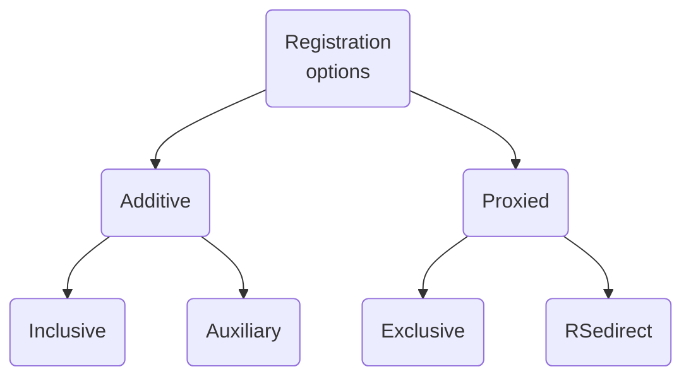
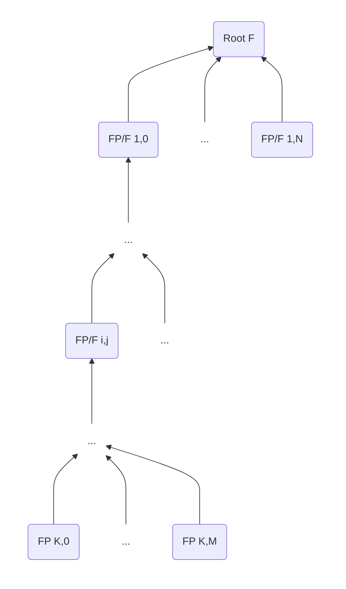
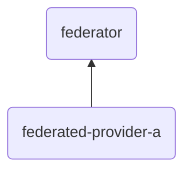

# FIWARE Data Space Connector Federation


## Maintainers

| Name | Email |
| ---- | ------ |
| cristianmartella | <cristian.martella@unisalento.it> |

## Source Code

* <https://github.com/cristianmartella/fdsc-scenario-02>
* <https://github.com/FIWARE/data-space-connector>

## Table of contents

- [FIWARE Data Space Connector Federation](#fiware-data-space-connector-federation)
  - [Maintainers](#maintainers)
  - [Source Code](#source-code)
  - [Table of contents](#table-of-contents)
  - [Introduction](#introduction)
  - [New distributed deployment features beyond federations](#new-distributed-deployment-features-beyond-federations)
  - [Registration operations](#registration-operations)
    - [Additive registrations](#additive-registrations)
    - [Proxied registrations](#proxied-registrations)
  - [Demo scenario](#demo-scenario)
    - [Architecture](#architecture)
      - [General model](#general-model)
      - [Demo scenario architecture](#demo-scenario-architecture)
  - [Components overview](#components-overview)
  - [Setup k3s cluster](#setup-k3s-cluster)
    - [Enable storage](#enable-storage)
  - [Quick deployment scripts](#quick-deployment-scripts)
  - [APIs](#apis)

## Introduction

Federated deployments are distributed deployments that transparently give applications access to context information from different players running own context brokers (CBs).
A federated scenario is not technically different from other distributed scenarios, but the assumption is that it goes across administrative boundaries and there is no central control that can be assumed.

In federated scenarios, the focus typically is on accessing (and possibly aggregating) context information from multiple CBs, while the management of the information (create, update, delete) is done locally in each domain.

## New distributed deployment features beyond federations

In NGSI-LD, the **default** federated case relates to **CB-to-CB federation**. Other common distributed deployment scenarios include:

* Support for actuation (IoT Agents)
* Support for "lazy" attributes (IoT Agents)
* Explicit distribution of context information (e.g. one context source for vehicles, one for bicycles, etc.)
* Backup context sources
* Complex data sharing scenarios

These scenarios require a different **subset of operations** to the standard federation case (a full CB is often not required). In particular, in some scenarios, security concerns may explicitly deny certain operations. In other cases, some entities or attributes may only b eobtained from a single specific context source (e.g. device actuation), while others could be augmented from multiple sources with limited availability.

## Registration operations

There are four types of **registration operations**, two additive and two proxied.



### Additive registrations

This group encompasses registrations for which a CB *is permitted* to hold context data about entities and attributes locally itself, and also obtain data from (possibly multiple) external sources.

The two **context source registrations** (CSR) included in this group are:

* **Inclusive** CSR (**default mode** of operation) - An inclusive CSR specifies that the CB considers all registered context sources as equals and will distribute operations to these context sources even if relevant data is available directly withinb the CB itself (in which case all results will be integrated in the final response).
* **Auxiliary** CSR - An auxiliary CSR never overrides data held directly within a CB. Auxiliary distributed operations are limited to context information consumption operations: context data from auxiliary context sources is only included if it is supplementary to the context data otherwise available to the CB.

### Proxied registrations

In this case, a CB *is not permitted* to hold context data about the entities and attributes locally itself. All context data is obtained from the external registered sources.

The two CSR included in this group are:

* **Exclusive** CSR - All of the context data registered is held in a single location external to the CB. The CB itself holds no data locally about the registered attributes on the entity. An exclusive registration **must be fully specified**. It always relates to specific attributes found on a single Entity. Exclusive CSR can be used for actuations.
* **Redirect** CSR - Registered context data is held in a location external to the CB (as well), but potentially multiple distinct redirect registrations can apply at the same time.

## Demo scenario

The demo includes the federation of two participants: a **federator** and a **federated data provider**. The federated data provider establishes a CSR with the federator, making the entities stored in its data service consultable from the federator's data service.

To this end, the federated data provider authenticates to the federator and acquires the necessary authorization to use (i.e. consume) the federator's data service. Thus, from the participant configuration standpoint, the federated data provider can be considered as an hybrid between a Provider and a Consumer and will include the following services:

* A data service used to store entities that will be made available at the federator through the CSR
* A verifiable credential issuer service used to authenticate to the federator

For the purposes of this demo scenario, the federated provider data service will be accessible without authentication layer. Nevertheless, it is possible to include the authentication layer by integrating the required PEP, PDP and PAP components.

### Architecture

#### General model

The general model consists of a multi-level hierarchy of federated context sources where each participant aggregates the contributions offered by downstream context units (i.e. federated providers) and potentially becomes a federated provider for its upstream federators. This scenario is illustrated in the following diagram.



The diagram shows the general tree topology of federator (F) and federated provider (FP) participants considered in this scenario. In particular, for a generic node $FP/F_{i,j}$, let $i\in\left[0,K\right]$ be the depth of the node in the hierarchy starting from the root node, where $K$ corresponds to the height of the tree. Similarly, let $j\in\left[0,Q\right]$ be the index of the node, where $Q$ corresponds to the maximum degree of its parent nodes.
The node $FP/F_{i,j}$ can participate to the federation of multiple upstream federators, while combining the contributions provided by context source registrations related to its downstream federated providers.

In this tree representation the root is a federator while the leaves are federated providers.

It is possible to combine multiple trees together and achieve advanced federation schemas.
For instance, is possible to have multiple federators for any given set of downstream federated providers. This consideration leads to more complex designs, but will not be further discussed because it is out of the scope of this work.

#### Demo scenario architecture

This demo scenario consists of two participants: a federator and a federated provider. The resulting two-levels architectural model is represented in the following diagram.



```txt
NOTE: the suffix '-a' emphasizes the possibility to scale up the model and include additional federated providers (e.g. with suffixes '-b', '-c', and so forth).
```

## Components overview

[k3s cluster deployment (fdsc-scenario-01)](https://github.com/cristianmartella/fdsc-scenario-01?tab=readme-ov-file#setup-k3s-cluster)

[Trust Anchor (fdsc-scenario-01)](https://github.com/cristianmartella/fdsc-scenario-01/blob/master/doc/trust-anchor/TRUST-ANCHOR.MD)

[Federator](./doc/federator/FEDERATOR.MD)

[Federated provider](./doc/federated-provider/FEDERATED-PROVIDER.MD)

## Setup k3s cluster

```bash
sudo systemctl stop k3s.service

cd base-cluster

mvn clean deploy

export KUBECONFIG=<PROJECT_HOME>/base-cluster/target/k3s.yaml
```

Replace PROJECT_HOME with full path to the project. Can be `$(pwd)` from the project root.

### Enable storage

```bash
kubectl apply -f https://raw.githubusercontent.com/rancher/local-path-provisioner/v0.0.30/deploy/local-path-storage.yaml
```

## Quick deployment scripts

The whole setup and deployment of the FDSC instance presented in this documentation can be streamlined by using the quick deployment scripts located in the script folder:

* 01.deploy_cluster.sh
* 02.deploy_trust_anchor.sh
* 03.deploy_provider.sh
* 04.create_wallet.sh

An additional maintenance script called `00.cleanup.sh` allows to uninstall the environment and even purge the cluster, if necessary.

The usage of the quick deployment and cleanup scripts is detailed [here](doc/SCRIPTS.MD).

## APIs

The interaction with the FDSC instance in a federated scenario is documented [here](doc/FEDERATION.MD).
