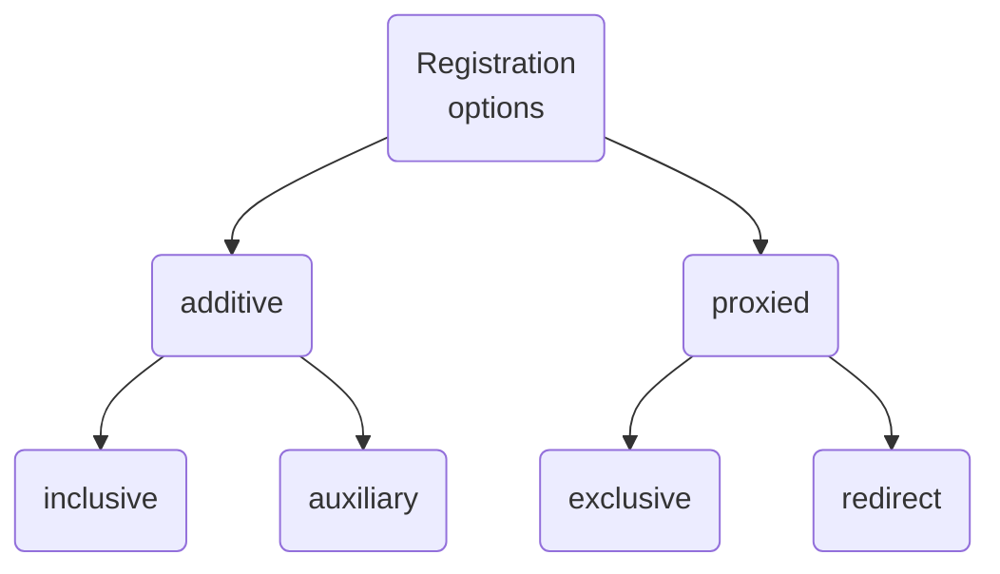

# FIWARE Data Space Connector Federation

## Table of contents

- [FIWARE Data Space Connector Federation](#fiware-data-space-connector-federation)
  - [Table of contents](#table-of-contents)
  - [Introduction](#introduction)
  - [New distributed deployment features beyond federations](#new-distributed-deployment-features-beyond-federations)
  - [Registration operations](#registration-operations)
    - [Additive registrations](#additive-registrations)
    - [Proxied registrations](#proxied-registrations)

## Introduction

Federated deployments are distributed deployments that transparently give applications access to context information from different players running own context brokers (CBs).
A federated scenario is not technically different from other distributed scenarios, but the assumption is that it goes across administrative boundaries and there is no central control that can be assumed.

In federated scenarios, the focus typically is on accessing (and possibly aggregating) context information from multiple CBs, while the management of the information (create, update, delete) is done locally in each domain.

## New distributed deployment features beyond federations

In NGSI-LD, the **default** federated case relates to **CB-to-CB federation**. Other common distributed deployment scenarios include:

- Support for actuation (IoT Agents)
- Support for "lazy" attributes (IoT Agents)
- Explicit distribution of context information (e.g. one context source for vehicles, one for bicycles, etc.)
- Backup context sources
- Complex data sharing scenarios

These scenarios require a different **subset of operations** to the standard federation case (a full CB is often not required). In particular, in some scenarios, security concerns may explicitly deny certain operations. In other cases, some entities or attributes may only b eobtained from a single specific context source (e.g. device actuation), while others could be augmented from multiple sources with limited availability.

## Registration operations

There are four types of **registration operations**, two additive and two proxied.

### Additive registrations

This group encompasses registrations for which a CB *is permitted* to hold context data about entities and attributes locally itself, and also obtain data from (possibly multiple) external sources.

The two **context source registrations** (CSR) included in this group are:

- **Inclusive** CSR (**default mode** of operation) - An inclusive CSR specifies that the CB considers all registered context sources as equals and will distribute operations to these context sources even if relevant data is available directly withinb the CB itself (in which case all results will be integrated in the final response).
- **Auxiliary** CSR - An auxiliary CSR never overrides data held directly within a CB. Auxiliary distributed operations are limited to context information consumption operations: context data from auxiliary context sources is only included if it is supplementary to the context data otherwise available to the CB.

### Proxied registrations

In this case, a CB *is not permitted* to hold context data about the entities and attributes locally itself. All context data is obtained from the external registered sources.

The two CSR included in this group are:

- **Exclusive** CSR - All of the context data registered is held in a single location external to the CB. The CB itself holds no data locally about the registered attributes on the entity. An exclusive registration **must be fully specified**. It always relates to specific attributes found on a single Entity. Exclusive CSR can be used for actuations.
- **Redirect** CSR - Registered context data is held in a location external to the CB (as well), but potentially multiple distinct redirect registrations can apply at the same time.